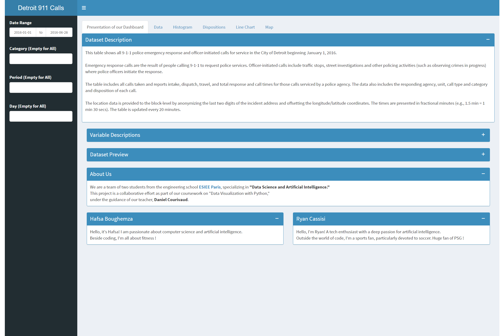
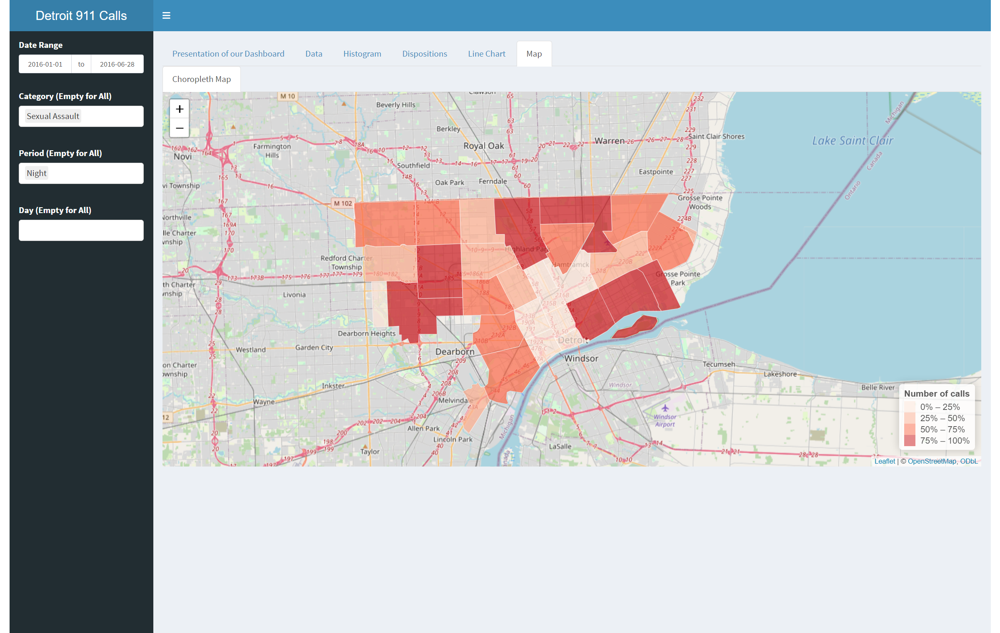
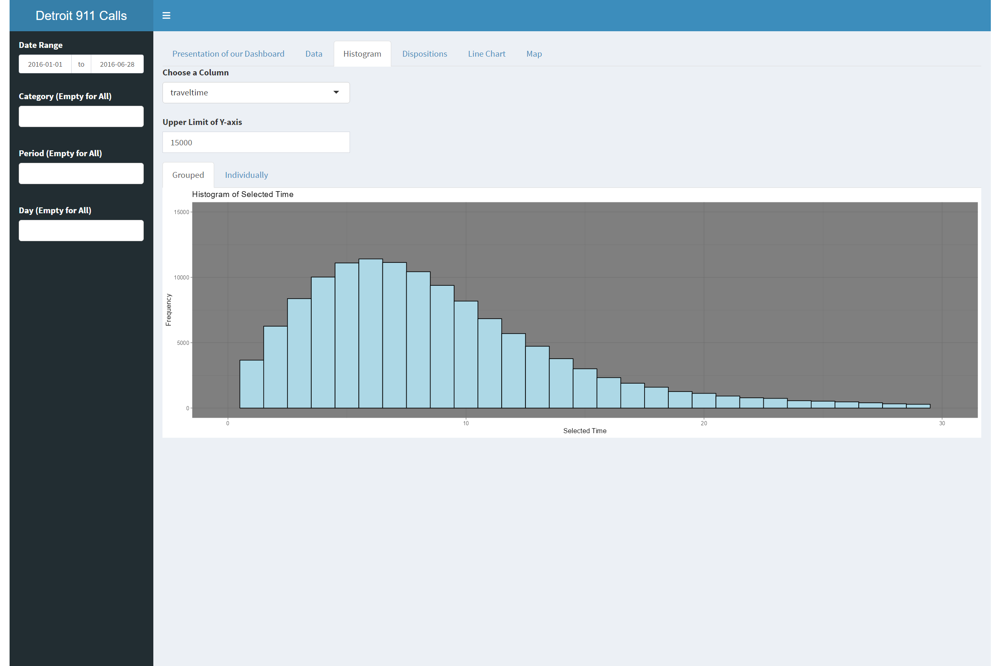

# data_visualisation_R_boughemza_cassisi

=====================================================================================

# Dashboard
The goal of this dashboard is to provide analysis of 911 Emergency calls of the Detroit's Police.
With our data processing and analytics, we aim to offer insights and visualizations that can help understand patterns, trends, and critical information related to emergency incidents.

## How it Works 
The analytics dashboard allows you to use filters with specific features to view key point of our graphical analysis. 

You have several filter on th left of the application. 
### Features
There are 4 different features : 
* Date Range: This filter allows you to select a range to view inside all our histogram, graph or map.
* Category: It allows you to filter the database with specific category of emergency call and make specific analytics search.
* Day: This filter allows you to select a specific day of the week.
* Period : This filter allows you to select a specific time of the day, for instance only the night calls.

### Graphical Representations
* Interactive Graphs: Explore our database  with interactive Histograms, Line Charts, Pie Charts, and Bar Charts, offering diverse perspectives and valuable insights.
* Interactive Maps: Navigate through our interactive maps, visualizing the geographical distribution of 911 emergency calls.
* Interactive Text: Stay informed with real-time updates, including the current number of calls and average response times, displayed interactively on the dashboard.

## How it Looks
You can see below an overview of our beautiful application :

## Code Architecture :
The code is structured in 3 files :
* **ui.R** : for the front end.
* **server.R** : for the back end.
* **global.R** : for utility functions, data reading,cleaning and processing.

# Analysis report
An in-depth analysis of emergency calls handled by the Detroit Police in 2016 reveals significant trends and critical insights into the dynamics of emergency responses.

We assessed various average response times, finding that the overall average intervention time is approximately 37 minutes and 11 seconds. The "on-site time" constitutes over half of this duration, underscoring its crucial importance. Conversely, the initial step, from call reception to transmission, is managed very responsively, with an average time of only 1 minute and 26 seconds.

Examining calls over time highlights activity peaks in the afternoon and during the night, suggesting correlation with periods when people work or reside in these areas. Unexpectedly, burglaries are more frequent in the afternoon than at night. Additionally, crimes and assaults reach their minimum in the morning and peak at night.

A focused exploration of accidents reveals significant challenges, with an average total time of approximately 90 minutes. The "on-site time" is notably high, influenced by the complexity of accidents and the need for thorough investigations.

Graphs emphasize that the majority of calls reveal no issues once on-site, while a considerable number lead to the initiation of investigations.

Temporal analysis using a line chart shows a noticeable increase in calls between February and March. Although the "pranks" category influences the overall curve, its exclusion does not alter the general trend. Other categories, such as "investigation," "domestic," "traffic," and "assault," follow the same overall trend. In contrast, some, like "traffic," "sexual assault," and "fire," show a linear decrease from February, while "incident" and "animal" linearly increase over time.

Lastly, geographical maps reveal disparities in the frequency of emergency calls, identifying less solicited neighborhoods and areas at risk for accidents. This information can guide road safety initiatives and more effective resource deployment strategies.

This comprehensive analysis provides a robust foundation for informed decision-making and targeted actions, emphasizing the importance of a deep understanding of emergency data for a more effective response.

# User's Guide

**Installation and execution**
To use the code, we recommend that you use R Studio. If you don't have this application, here's the download link: https://posit.co/download/rstudio-desktop/
* Code recovery: git clone https://git.esiee.fr/boughemh/data_visualisation_r_boughemza_cassisi
* Run the code :
	* The dashboard will be launched in R Studio with the command: File > Open Project > ... > ...Rproj
	* Next, open the files in the FootApp folder, and run the global.R file.
	* To launch the ShinnyApp, simply press the "Run App" button in the top right-hand corner of the global.R. file.
	* To launch the ShinnyApp directly in the browser, simply press the down arrow next to the "Run App" button and select "Run External".
	* You can also write in the terminal: runApp('PoliceApp')

**Installing the necessary packages**

* packages to install:
    * leaflet
    * shinydashboard
    * dplyr
    * shinythemes
    * lubridate
    * sf
    * sp
    * shiny
    * tmap
    * data.table

* To install these packages, run the following command in your terminal:
    * install.packages("package_name")

# Developper Guide

**If you want to modify the code or use it for a personal project, follow these instructions in order:**

* Go to the directory where you want to clone the project.
* In your terminal, run:
    * git clone https://git.esiee.fr/boughemh/data_visualisation_r_boughemza_cassisi

**Then, if you want to upload your changes to the git, follow these instructions in order:**

* git add "filename 
* git commit -m "message
* git push
